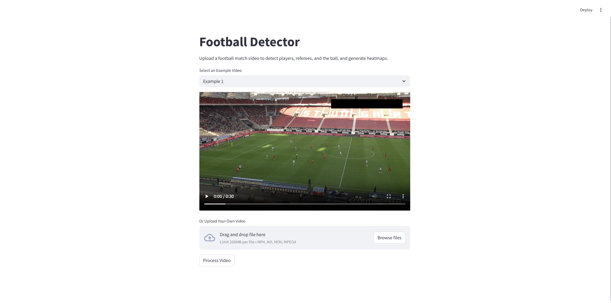

# Football-Detector

## 项目简介
本项目是基于迁移学习与聚类实现的足球运动员识别系统，通过在屏幕上显示控球率、运动轨迹等元素为球队提供良好的可复盘能力。
项目基于预训练模型`YOLOv5`，使用`roboflow`网站经人工标注的足球比赛数据集进行迁移学习训练，使其在足球比赛目标识别上提供更好的效果。
出于区分球员所属队伍的需求，项目使用`KMeans++`聚类算法对运动员球衣颜色进行聚类，从而达到区分球队的目的。

## 项目特点
- 基于`YOLO`提供的目标识别能力，通过迁移学习，提高模型对足球运动员的识别能力。
- 通过微调训练，解决了`YOLO`模型直接进行识别会出现的非预设目标(如边线外人员)被识别问题。
- 通过`KMeans++`算法，根据球员的球衣颜色进行聚类，将球员划分为两个队伍。
- 通过数据增强，对训练使用的每一帧进行插值以标明球的位置，从而解决球速过快带来的球识别困难而导致的训练不佳问题。
- 实现轨迹模块，用以显示场上人员距离球的距离并计算热力图，热力图可以显示球员的跑动轨迹信息以进行赛后复盘。

## 如何运行本项目
- 输入`pip install -r requirements.txt`安装所有依赖
- 在项目根目录下，启动终端运行命令`python train.py`进行训练
- 训练过程中，项目根目录下将出现`yolov5xu.pt`文件，训练好后，它将存放在`models/`下，请将其改名为`best_yolo.py`
- 在项目根目录下，启动终端运行命令`streamlit run run.py`，即可进入前端界面，界面中会展示测试用的视频，点击`process`按钮即可进行测试。

## 参考资料
- [football competition train dataset](https://universe.roboflow.com/roboflow-jvuqo/football-players-detection-3zvbc)
- [football competition test dataset](https://www.kaggle.com/datasets/saberghaderi/-dfl-bundesliga-460-mp4-videos-in-30sec-csv)
- [football_analysis](https://github.com/abdullahtarek/football_analysis)
